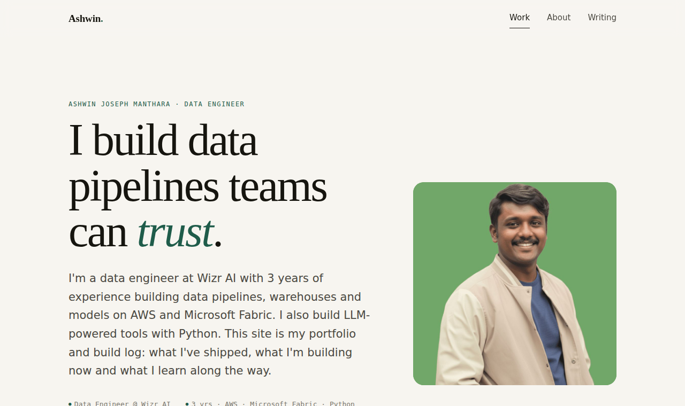

# Ashwin Joseph Manthara · Portfolio & Build Log

**Live site → [ashwin-jm.github.io](https://ashwin-jm.github.io)**

My personal portfolio and learning journal as a Data Engineer. It shows the projects I've shipped, what I'm building right now, and the articles I write along the way.



## What's on the site

| Page | What it shows |
|---|---|
| **Work** (`index.html`) | Intro, a live *Currently building* card with milestone progress, selected projects with data-flow diagrams, and the latest posts |
| **About** (`about.html`) | Background, experience timeline, toolkit, certifications and how I work |
| **Writing** (`blog.html`) | My Medium articles, loaded automatically and filterable by topic |

## Features

- **Articles sync automatically.** A scheduled GitHub Action pulls my Medium RSS feed every 3 hours and saves it as `assets/data/posts.json`. The page also checks the live feed and merges the two.
- **Content lives in data files.** Profile details, projects and the *Currently building* card are all in plain JavaScript files, so the HTML never needs editing.
- **Project cards show how things work.** Each project has a data-flow diagram, a list of what I built, the tech stack, and optional metrics, repo link and write-ups.
- **Topic filters.** Medium tags become filter chips on the Writing page.
- **Responsive and accessible.** Works on phones, uses semantic HTML, and respects reduced-motion settings.
- **No build step or dependencies.** Plain HTML, CSS and JavaScript, hosted free on GitHub Pages.

## Tech stack

- **Frontend:** HTML5, CSS3 (custom properties, grid), vanilla JavaScript
- **Content:** Medium RSS, synced by GitHub Actions + Python, with [rss2json](https://rss2json.com) as a live fallback
- **Fonts:** Fraunces, Inter and JetBrains Mono (Google Fonts)
- **Hosting:** GitHub Pages

## Project structure

```
├── .github/workflows/
│   └── sync-medium.yml     # Scheduled Medium → posts.json sync
├── scripts/fetch_medium.py # RSS → JSON (standard library only)
├── index.html              # Work / home
├── about.html              # About
├── blog.html               # Writing
└── assets/
    ├── css/style.css       # Design tokens + all styles
    ├── js/config.js        # Profile, links, "Currently building" data
    ├── js/projects.js      # Projects data
    ├── js/main.js          # Rendering: projects, Medium feed, filters, now-card
    ├── data/posts.json     # Synced Medium posts
    └── img/                # Photo, social preview, favicon
```

## Run locally

```bash
git clone https://github.com/ashwin-jm/ashwin-jm.github.io.git
cd ashwin-jm.github.io
python -m http.server 8000     # then open http://localhost:8000
```

(You can also just open `index.html` in a browser.)

## Contact

- LinkedIn: [linkedin.com/in/ashwin-jm](https://www.linkedin.com/in/ashwin-jm/)
- Medium: [medium.com/@ashwinjm](https://medium.com/@ashwinjm)
- Email: ashwinjm25@gmail.com

---

© Ashwin Joseph Manthara. The code is free to learn from. Please don't reuse the personal content (text, photo, résumé).
